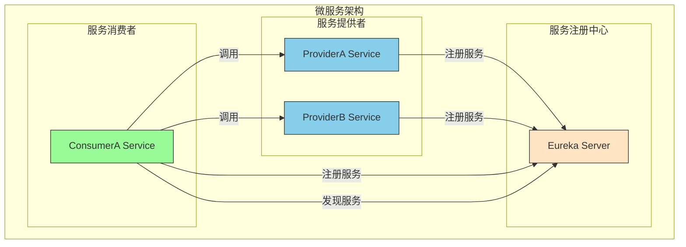

# Spring Cloud  学习

搭建微服务应用
第一步搭建基础微服务
第二步：  限流，熔断， 分布式事务seata, 
第三步： 链路追踪

## day 1
创建一个spring cloud 应用，使用  OpenFeign 进行通信
实现 FIRST-CONSUMER 服务和 FIRST-PROVIDER 注册到 Eureka 服务
并实现  FIRST-CONSUMER 使用 Feign 调用 微服务  FIRST-PROVIDER
### 主要知识点 
* spring cloud 组成， 架构：
* 微服务通信方式 RPC 和 HRTTP
微服务之间的通信⽅式, 通常有两种: RPC 和 HTTP.
在SpringCloud中, 默认是使⽤HTTP来进⾏微服务的通信, 最常⽤的实现形式有两种：
RestTemplate
OpenFeign

参考： https://cloud.tencent.com/developer/article/2407573

## day 2 
### 补充架构图

  ```mermaid
    flowchart LR
      A["JS"]
      B["Mermaid"]
      C["Markdown 原生"]
      D["Markdown 定制"]
      A --制作了--> B --内嵌到了 --> C --衍生了--> D
  ```


##  PS
学习路线查看
https://cloud.macrozheng.com/cloud/cloud_preview_13.html
变码变实践


### 参考
https://developer.aliyun.com/article/881962